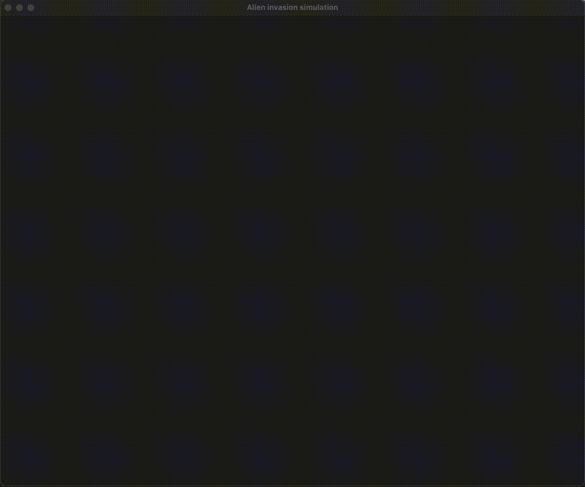

# Alien invasion simulator

Application builds a map of interconnected cities and drops aliens on the map. Aliens can freely move between connected cities, but when they collide with each other, a battle begins. The result of the battle is a city destruction which also eliminates the aliens involved. Each alien has a movement limit, so if he didn't face an encounter or he was "trapped" (found himself on a disconnected part of the map), he evacuates from the world. Simulation stop when only alien is left on the map or the entire world is destroyed.

The simulation process is asynchronous (every alien acts independently from others), so no clock ticks or other synchronization methods were used. This approach was used as it is fun to visualize compared to a step-based one (where the whole map state changes in a single tick).

To visualize the process, here is a short demo:



## Simulation details

### Map

Map is provided by user via a text file which follows the format:

```
{CityName} north={UpperNeighbour} east={RightNeighbour} south={LowerNeighbour} west={LeftNeighbour}
```

* `north/east/south/west` side defines an existing road, which connects that city with another one. Those roads are optional, so a city might have no neighbors (initially or they were destroyed);
* `{CityName}` is a unique city name;

Map example can be found [here](build/map_28.aimap).

The application validates a map file:

* A city defined by a road (`north=FooBar`) should exist;
* If city A is connected to city B, city B should be connected to A as well (`A north=B`, `B south=A`);
* City name contains alpha symbols (English alphabet) with optional space or `-` symbol. Some examples for a valid city name:
  * Foo;
  * FooBar;
  * Foo-Bar;
  * Foo Bar;
  * foo bar;
* Each city should be defined once (no duplicates allowed);

### Alien

Aliens are auto-generated and each one has the following parameters:

* Name (`#00000012`).
* Speed. How fast an alien moves between cities.
* Power. When two (or more) aliens collide, the sum of their powers defines how long the battle will take. Since a battle can take time, more aliens can step into the fighting city prolonging the battle duration.
* MaxSteps. A number of moves for an alien is limited and when it reaches zero, the alien is being evacuated (better luck next time).

Alien params are defined within the application config and for some of them (speed, power), the random value range is set.

If an alien wants to move from a city, but there is a battle happening, he can't do so (alien can't escape the battle). At the same time, an alien can enter a battling city and participate in the fight.

### Disembark

The process of aliens dropping to the map is extended over time: some can start moving and fighting earlier than others. A drop-off location is picked randomly, so it could happen that a bunch of aliens would be dropped to the same city starting the fight immediately. Also, a picked location can no longer exist (destroyed while that alien was landing) and in that case, an alien just skips the planet entirely.

## Project

Libraries:

* [Cobra](https://github.com/spf13/cobra) to build the CLI interface;
* [Viper](https://github.com/spf13/viper) for app configuration:
  * The config file is optional since every key has a default value;
  * Every config key can be overridden using a corresponding ENV (`AI_APP_SCREENWIDTH` for the `app.screenWidth` key);
  * Config example with comments can be found [here](build/config.toml);
* [Zerolog](https://github.com/rs/zerolog) for logging;
* [Ebiten](https://ebiten.org) for 2D rendering:
  * That one was picked as it was easily googled and it is easy to use;

Structure:

* `/build` - example configs and maps;
* `/cmd` - application entrypoint and CLI layer;
* `/model` - domain models with constructors and generators;
* `/pkg` - various utils and helpers:
  * `/pkg/config` - Viper keys, defaults and validation rules for app config;
  * `/pkg/logging` - Utils to create and pass a logger over `context.Context`;
* `/service` - buisiness logic layer:
  * `/service/sim` - simulation engine;
  * `/service/monitor` - reactor service for simulation engine events (alien relocated, city destroyed, etc.):
    * `/service/monitor/noop` - monitor that logs every event;
    * `/service/monitor/display` - 2D rendering monitor that visualizes a simulation;

## Build & run

Requirements:

* Go 1.17 (at least);
* Ebiten library dependencies installed:
  * Follow the official [instructions](https://ebiten.org/documents/install.html), Disclaimer: should work out of the box (tested on OS X).

### Build

```bash
make build-binary
```

That should build the `ai` binary in the project root directory.

### Run

Use build-in help to get all available flags and their defaults.

```bash
./ai -h
./ai start -h
./ai map -h
```

#### Text mode simulation

```bash
./ai start -m ./build/map_28.aimap -a 25
```

That command uses the example map and spawns 25 aliens.

To stop the simulation: `Ctrl+C`.

#### Visual mode simulation

```bash
./ai start -m ./build/map_28.aimap -a 25 -d
```

To stop the simulation: `Ctrl+C` or close the window.

## Points of improvement

* Test coverage. At the moment there are no tests and some parts should be refactored to support deterministic testing (for example alien runner is fully random and can't be mocked).
* Simulation engine scalability. At the moment engine runner that listens to requests and sends events, is single-instanced. That approach made it possible to avoid extensive aliens/cities/world states locking, but is not scalable. Some kind of a router that selectively locks resources needed might be considered.
* 2D rendering and animation. This is my first attempt to do any 2D rendering, so the current code can have a lot of issues I have no idea about.